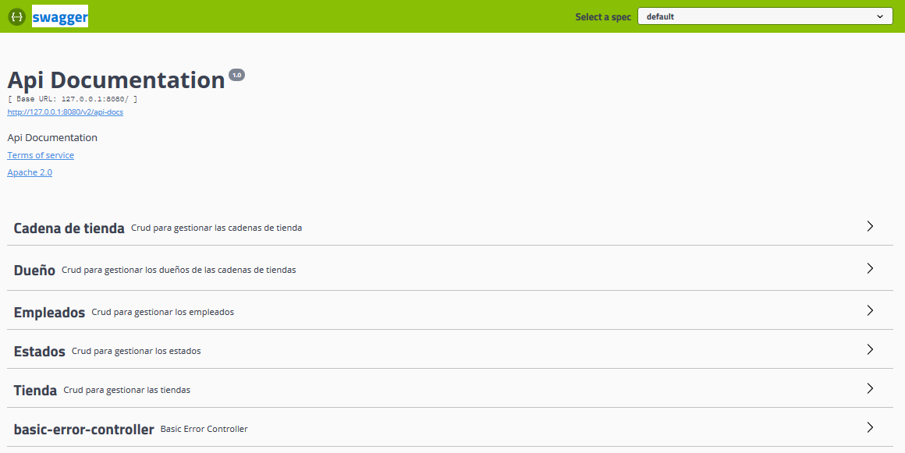
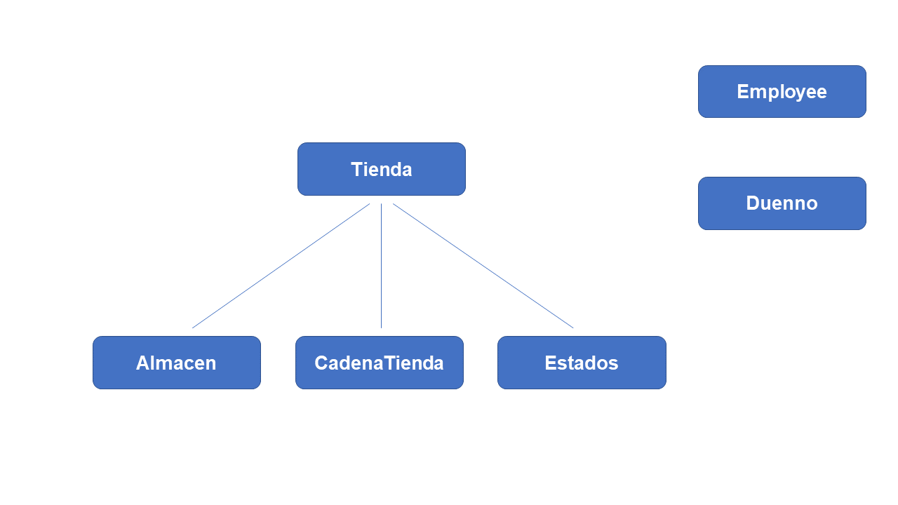

# Ejemplo de API REST con Spring Boot + MongoDB + Swagger2

## API expuesta por Swaggwe2

http://127.0.0.1:8080/swagger-ui.html

     

## Modelo conceptual del negocio

Las Colecciones MongoDB están referenciadas entre si de la siguiente manera:

     

Las cuales están compuestas por las siguientes propiedades:

Almacen: {
    id: Long,
    descripcion: String,
    codigo: String
}

CadenaTienda: {
    id: Long,
    descripcion: String,
    codigo: String
}

Duenno: {
    id: Long,
    nombre: String,
    segNom: String,
	ap1: String,
	ap2: String
}

Employee: {
    id: Long,
    firstName: String,
    lastName: String,
    emailId: String,
    municipio: String,
    estado: String,
    pais: String,
    ZIP: Integer
}

Estados: {
	id: Long,
	descripcion: String,
	codigo: String
}

Tienda: {
	id: Long,
	descripcion: String,
	codigo: String,
	estado: Estados,
	cadenaTienda: CadenaTienda,
	almacenes: List<Almacen>
}
